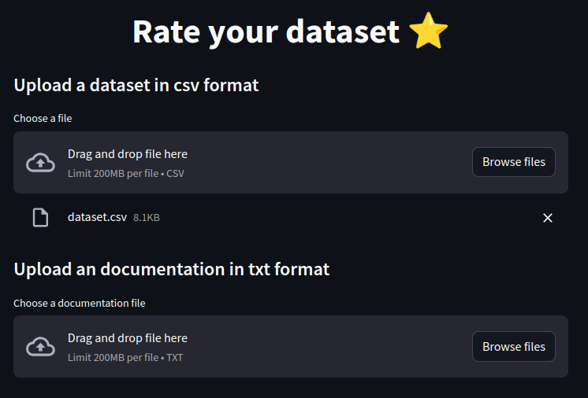
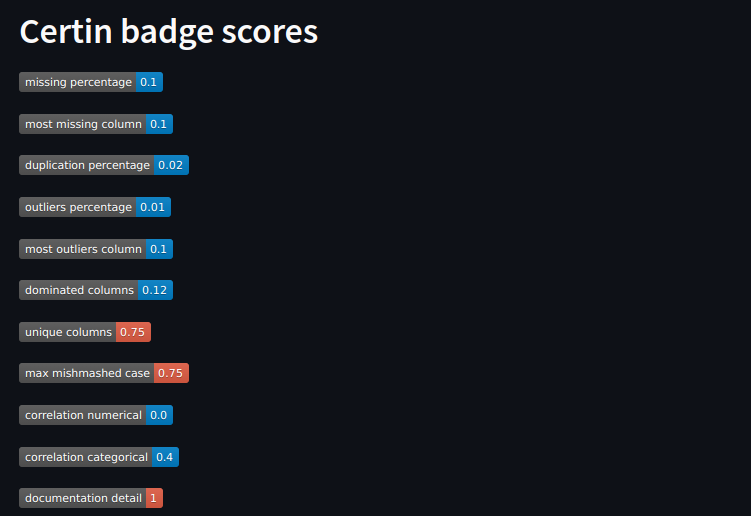
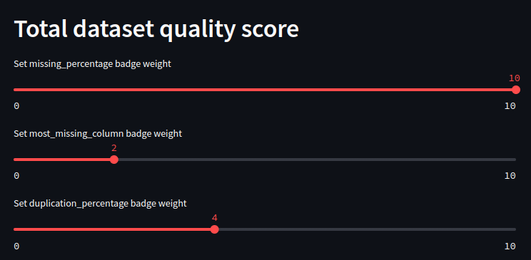
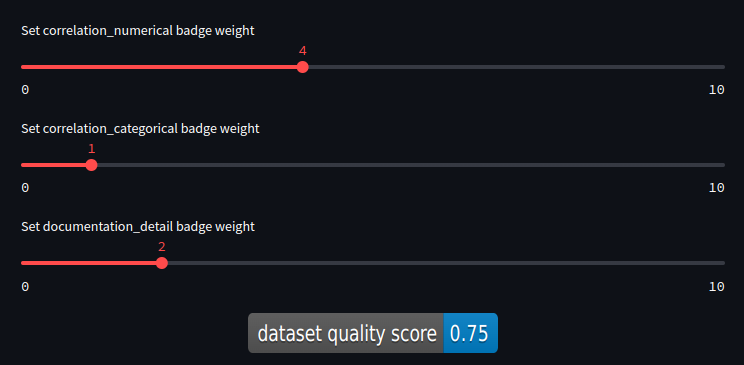

# Data Quality labeler

An app to automatically check dataset quality and create a badge for it. Created as a final project for biomedical data science on UPV

Includes also fake dataset creator.

## Run app
To run this app, copy and paste below commends. 
```bash
$ git clone https://github.com/annapanfil/data_quality_labeler/tree/main
$ git checkout web_app
$ conda create --name your_env_name
$ conda activate your_env_name
$ pip install pandas=1.5.3
$ pip install streamlit
$ pip install faker
$ pip install numpy
$ streamlit run main.py  
```

## Screen shots from app 



